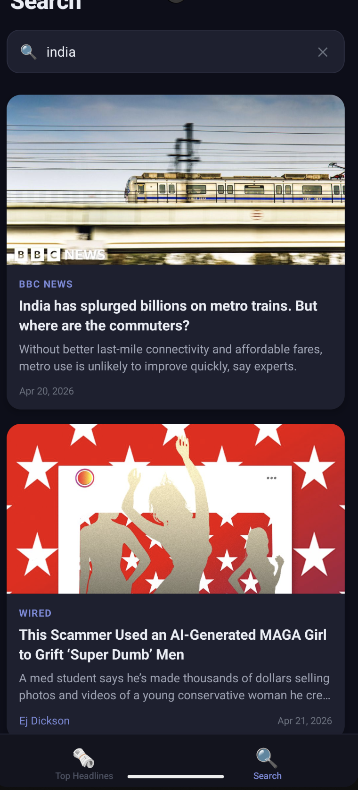

# NewsReader 📰

A production-ready React Native news reader app (Android + iOS) built entirely from scratch with the React Native CLI (no Expo). This project is designed to showcase clean architecture, robust state management, and real-world performance considerations without relying on third-party UI libraries.

## 📱 Screenshots

<div align="center">
  
  &nbsp;&nbsp;&nbsp;&nbsp;
  
  &nbsp;&nbsp;&nbsp;&nbsp;
  
</div>
<div align="center">
  <em>HomeScreen • SearchScreen • ArticleDetailScreen</em>
</div>

---

## ✨ App Functionality

This app was built to demonstrate a production-ready mobile architecture matching the technical requirements:

- **2–3 screens with proper navigation** — Features a Stack + Bottom-Tab navigation system navigating between Home, Search, and Article Detail screens.
- **Large list of data from a public API** — Fetches live US top headlines from [NewsAPI](https://newsapi.org).
- **Search functionality** — Debounced full-text search across all articles.
- **Pagination or infinite scrolling** — Implements infinite scrolling and pull-to-refresh on both Home and Search feeds.
- **Redux for state management** — Uses Redux Toolkit to manage all network states and async thunks cleanly.
- **Local data storage** — Cached headlines are stored in `AsyncStorage` so content is restored instantly after an app restart.
- **App Lifecycle Handling** — Articles are persisted when the app enters the background, and refreshed instantly when returning to the foreground or opening from a killed state.

---

## Prerequisites

| Tool           | Version                     |
| -------------- | --------------------------- |
| Node.js        | ≥ 22.x (`nvm use 22`)       |
| npm            | ≥ 10                        |
| Xcode          | ≥ 15 (iOS)                  |
| Android Studio | Hedgehog or newer (Android) |
| CocoaPods      | ≥ 1.14                      |
| Java (JDK)     | 17                          |

---

## Getting Started

### 1. Clone and install

```bash
git clone <repo-url>
cd NewsReader
npm install
```

### 2. iOS: Install CocoaPods

```bash
cd ios && pod install && cd ..
```

### 3. Add your NewsAPI key

Open `src/api/newsApi.ts` and replace the placeholder:

```ts
const API_KEY = 'YOUR_API_KEY_HERE'; // ← paste your key here
```

Get a free API key from [https://newsapi.org/register](https://newsapi.org/register).

### 4. Run the app

**iOS (simulator)**

```bash
npm run ios
```

**Android (emulator or device)**

```bash
npm run android
```

**Metro bundler (separate terminal)**

```bash
npm start
```

---

## Project Structure

```
src/
├── api/
│   └── newsApi.ts              # fetch wrappers for headlines + search
├── components/
│   ├── ArticleCard.tsx         # card used in both Home and Search lists
│   ├── SearchBar.tsx           # controlled TextInput with clear button
│   └── LoadingFooter.tsx       # pagination spinner
├── navigation/
│   └── RootNavigator.tsx       # stack + bottom-tab navigator
├── screens/
│   ├── HomeScreen.tsx
│   ├── SearchScreen.tsx
│   └── ArticleDetailScreen.tsx
├── store/
│   ├── index.ts                # configureStore, RootState, AppDispatch
│   ├── articlesSlice.ts        # home feed state
│   └── searchSlice.ts          # search state
├── hooks/
│   ├── useAppDispatch.ts       # typed dispatch hook
│   └── useAppSelector.ts       # typed selector hook
├── utils/
│   ├── storage.ts              # AsyncStorage helpers
│   └── lifecycle.ts            # AppState listener
└── types/
    └── index.ts                # Article, RootStackParamList, TabParamList
```

---

## Key Technical Decisions

### Redux Toolkit for all async state

All network state (loading, error, hasMore, items, page) lives in Redux slices — never in component `useState`. `createAsyncThunk` handles the full pending/fulfilled/rejected lifecycle cleanly.

### FlatList performance props

Every list uses `removeClippedSubviews`, `maxToRenderPerBatch`, `windowSize`, and `initialNumToRender` to keep 60fps scrolling even with large datasets. `onEndReachedThreshold={0.5}` + a guard in `handleLoadMore` prevents duplicate fetches.

### Hydrate-then-fetch pattern

On app open, cached articles from `AsyncStorage` are dispatched to Redux immediately (`hydrateFromCache`) so the user sees content instantly — then `loadHeadlines(1)` runs in the background to refresh with fresh data.

### AppState lifecycle

`AppState.addEventListener` is set up in `App.tsx` on mount. Going to background triggers a `saveArticles()` persist. Coming back to the foreground triggers `loadHeadlines(1)`. The listener is removed on unmount.

### No third-party UI libraries

Every UI element is built with core React Native primitives (`View`, `Text`, `Image`, `FlatList`, `TouchableOpacity`, `StyleSheet`). This keeps the bundle lean and dependency-free.

### 300ms debounced search

`setQuery` dispatches on every keystroke (so Redux owns the input value), but a `useEffect` + `setTimeout` in `SearchScreen` delays the actual API call by 300ms to avoid hammering the API.

---

## API Endpoints

| Screen       | Endpoint                                                |
| ------------ | ------------------------------------------------------- |
| HomeScreen   | `GET /v2/top-headlines?country=us&pageSize=20&page={n}` |
| SearchScreen | `GET /v2/everything?q={query}&pageSize=20&page={n}`     |

---

## Given More Time, I Would Add

| Feature                        | Rationale                                                                      |
| ------------------------------ | ------------------------------------------------------------------------------ |
| **Unit & integration tests**   | Jest + React Native Testing Library for slice reducers and component rendering |
| **Bookmarks / Saved Articles** | A third Redux slice + AsyncStorage key; third tab in the navigator             |
| **Full offline mode**          | Cache search results per query; show a "You're offline" banner via NetInfo     |
| **Article sharing**            | `Share.share()` from `react-native` — one call, zero extra deps                |
| **Push notifications**         | `@react-native-firebase/messaging` for breaking-news alerts                    |
| **Category filtering**         | NewsAPI supports a `category` param; add horizontal chip filters on HomeScreen |
| **Dark/light theme toggle**    | `Appearance` API + React context; already using a design token color system    |
| **Accessibility (a11y)**       | `accessibilityLabel`, `accessibilityRole`, and VoiceOver/TalkBack testing      |

---

## Tech Stack

| Layer      | Library                                   |
| ---------- | ----------------------------------------- |
| Framework  | React Native 0.85.3 (CLI)                 |
| Language   | TypeScript (strict)                       |
| Navigation | React Navigation v7 (Stack + Bottom Tabs) |
| State      | Redux Toolkit + react-redux               |
| Storage    | @react-native-async-storage/async-storage |
| HTTP       | Native `fetch` API (no axios)             |
| UI         | Core RN components only                   |
